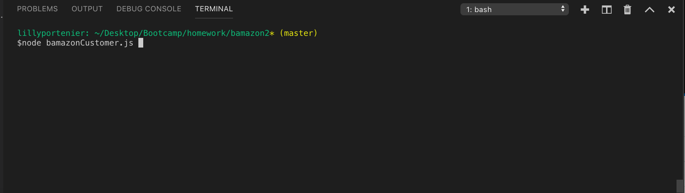
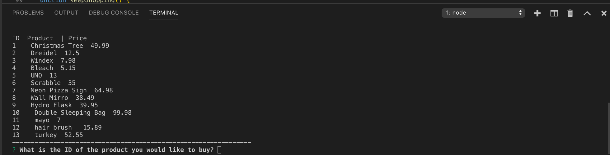

<h1>Bamazon</h1>

<h2>Description</h2>

Bamazon is a node command line application, based loosley on the popular online store, Amazon. This application allows the users to check what products are for sale and the price of the item, then purchase the item. There is also a manager page on that allows the maanger to check all the prodcuts for sale, check low inventory, add inventory to a current product, and add and entirely new product.

<h2>NPMs Used</h2>
<ul>
  <li>mySQL</li>
  <li>Inquirer</li>
</ul>

<h2>How To Use</h2>

<h2>Customer Interface</h2>

The customer interface presents the user with a list of availabe products, along with the product ID, and price. The customer is then able to purchase the item by specifying the item ID and the quantity of product.

<h2>Manager Interface</h2>

The manager interface uses inquirer to prompt the user to preform more advanced funcitons involving the mySQL database. The user is able to add product, update inventory, and more. To run the program naviage to the bamazon2 file, run the command 'node bamazonManager.js' in the command line, this shoudl look something like this:

The application should then use inquirer and allow the user to select one of the follwing options that will preform diffrent actions.

View Products for Sale: This action will show the user all of the product currently for sale at any given time. It will give the user the product ID, Name, Price, and the amount in Stock.

View Low Inventory: This prompt will show the user each product whos stock is at or lower then five units. It will display the name of the product, the department, and the actual amount of product in stock at the current time.

Add to Inventory: The add inventory option will allow the user to add additional units to an existing item for sale and update the stock in the database.

Add New Product: The final option in the manager interface is able to add an entire new product to the database. This requires the user to enter the name, price, department, and amount of units of the product through the console. These are all prompted thorugh inquirer for ease of use for the user.

